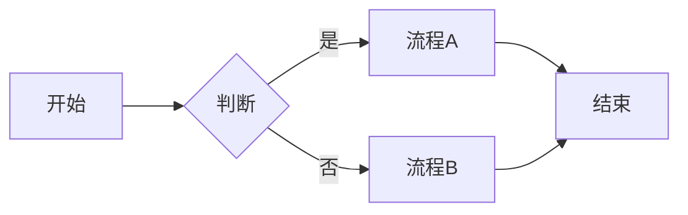
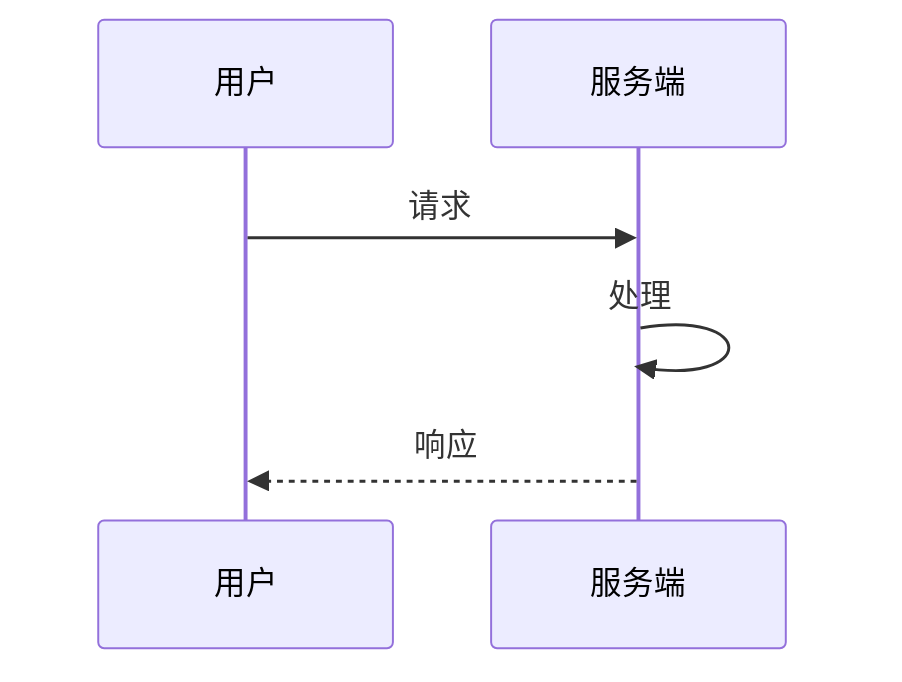
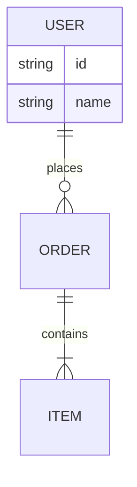

# Mermaid Expert

## When to Use

- PRD 中的流程图、业务流程图
- 接口/交互的时序图
- 数据模型的 ER 图
- 状态机、用户旅程
- 项目时间线（甘特图）
- 架构图、网络拓扑

## Approach

1. **选对图表类型**：根据数据/需求选择最合适的 diagram type
2. **保持可读**：避免节点过多，单图建议 ≤15 个节点
3. **统一风格**：颜色、线型、命名保持一致
4. **有意义标签**：节点和连线使用清晰的中文或英文描述
5. **验证渲染**：输出前确认语法正确，可在 [Mermaid Live Editor](https://mermaid.live) 预览

## Diagram Types

| 类型 | 关键字 | 适用场景 |
|------|--------|----------|
| 流程图 | `graph` / `flowchart` | 业务流程、决策树 |
| 时序图 | `sequenceDiagram` | API 调用、交互顺序 |
| 类图 | `classDiagram` | 数据结构、OOP 关系 |
| 状态图 | `stateDiagram-v2` | 状态机、用户旅程 |
| ER 图 | `erDiagram` | 数据库、实体关系 |
| 甘特图 | `gantt` | 项目排期、里程碑 |
| 饼图 | `pie` | 占比分布 |
| 时间线 | `timeline` | 事件时间线 |

## Quick Syntax Reference

### Flowchart（流程图）

- 方向：`TB`/`TD`(上→下)、`LR`(左→右)、`BT`、`RL`
- 节点形状：`[]` 矩形、`()` 圆角、`{}` 菱形、`[[]]` 子程序
- 连线：`-->` 实线、`-.->` 虚线、`==>` 粗线；`|文字|` 为连线标签

### Sequence Diagram（时序图）

- `->>` 实线箭头、`-->>` 虚线箭头
- `participant` 可简写为 `actor`（用户角色）

### ER Diagram（ER 图）

- 关系：`||--o{` 一对多、`||--||` 一对一、`}o--o{` 多对多

## Output Format

1. **完整 Mermaid 代码**：可直接粘贴到 Markdown 或 Mermaid Live 渲染
2. **基础版 + 可选样式版**：复杂图提供 `%% style` 注释说明
3. **备选方案**：若一种图表类型不合适，说明其他可选类型
4. **可访问性**：关键节点使用清晰 ID，避免纯符号

## Additional Resources

- 详细语法与更多示例，见 [implementation-playbook.md](resources/implementation-playbook.md)
