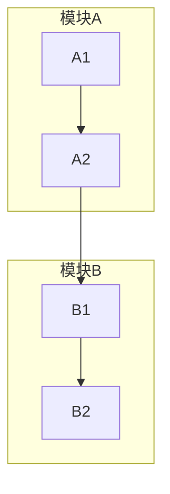
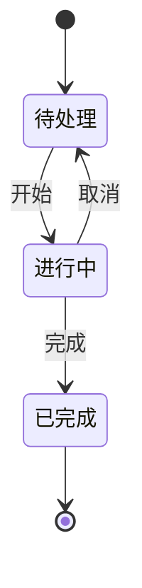
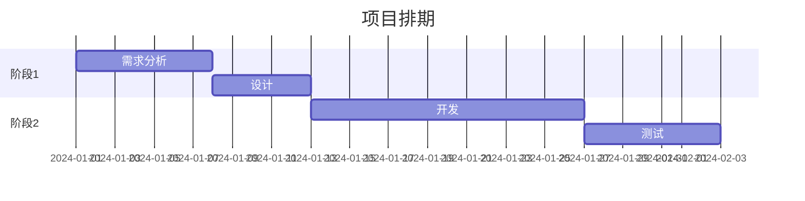
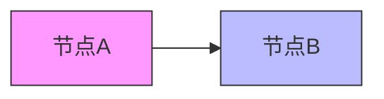

# Mermaid 语法参考

## Flowchart 详细语法

### 节点形状

| 语法 | 形状 |
|------|------|
| `A[文本]` | 矩形 |
| `A(文本)` | 圆角矩形 |
| `A{文本}` | 菱形（决策） |
| `A([文本])` | 体育场形 |
| `A[[文本]]` | 子程序 |
| `A[(文本)]` | 圆柱形（数据库） |
| `A((文本))` | 圆形 |

### 连线类型

```
A --> B    实线箭头
A --- B    实线无箭头
A -.-> B   虚线箭头
A ==> B    粗线箭头
A -- 文字 --> B  带标签
```

### 子图



## Sequence Diagram 详细语法

### 参与者

```
participant A as 别名
actor U as 用户
```

### 消息类型

```
A->>B  实线箭头（同步）
A-->>B 虚线箭头（异步/返回）
A->B   无箭头实线
A--B   无箭头虚线
```

### 激活/停用

```
activate A
A->>B: 消息
deactivate A
```

### 注释

```
Note over A,B: 跨参与者注释
Note right of A: 单侧注释
```

## State Diagram 语法



## Gantt 语法



## 样式定制



或使用 class：

```
classDef highlight fill:#ff9,stroke:#333
class A,B highlight
```

## 常见问题

1. **中文乱码**：确保文件/编辑器使用 UTF-8 编码
2. **特殊字符**：括号、引号需转义或使用引号包裹：`A["(特殊)"]`
3. **ID 冲突**：节点 ID 避免与关键字冲突，如 `end`、`style`
4. **过长文本**：使用 `<br>` 换行：`A[第一行<br>第二行]`
