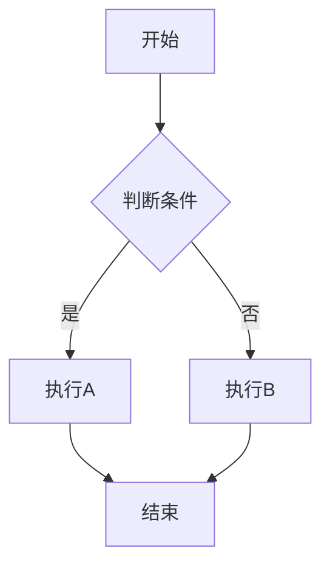
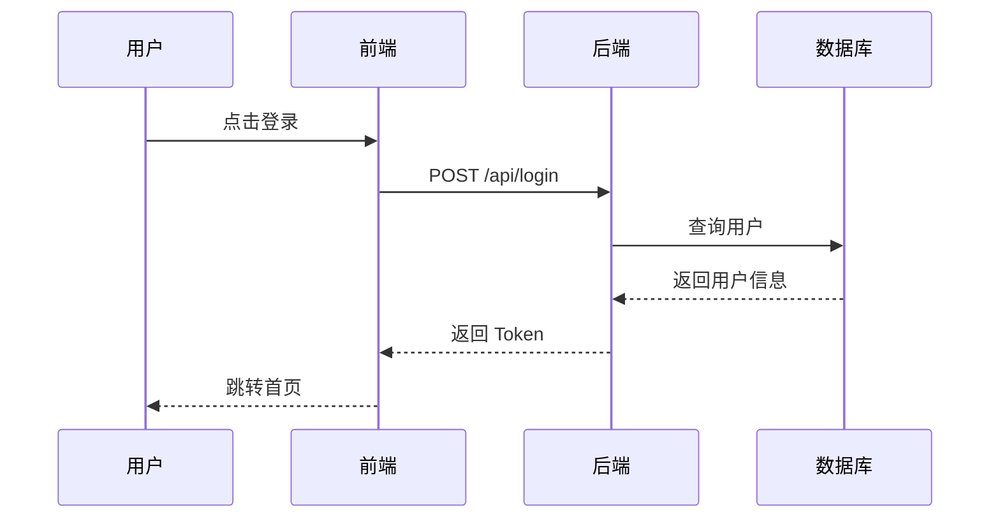
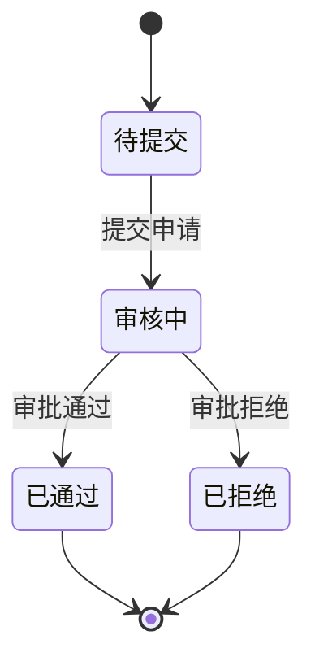
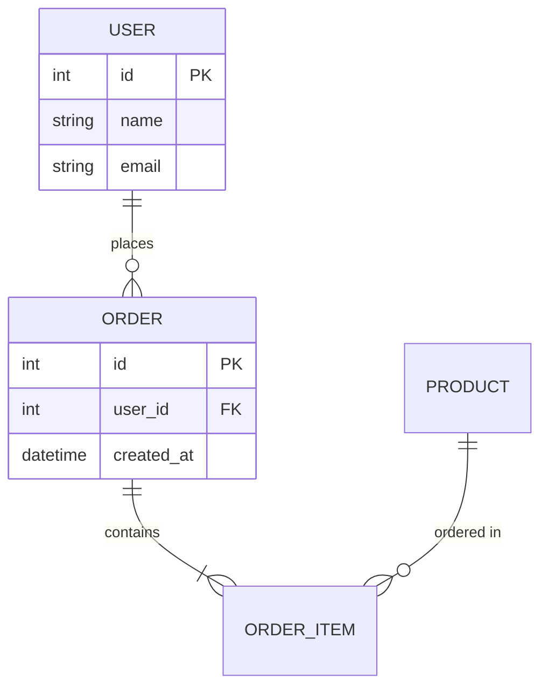
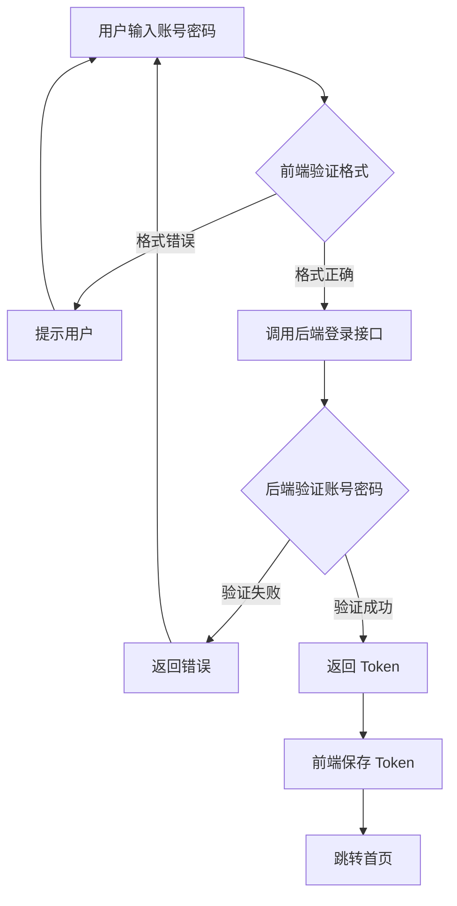
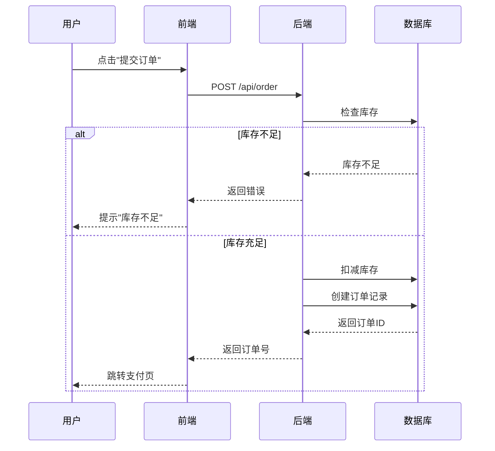
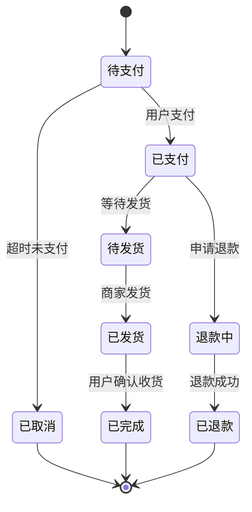

# Skill: Diagram Maker

## 📋 技能依赖声明

### 必须依赖
- ✅ `_WORK_SHEET.md` 文件存在（项目根目录）

### 可选依赖
- `03_Output/PRD_*.md` - 如果存在，优先基于PRD绘制流程图

### 依赖检查失败时的提示
```
⚠️ 流程绘图需要先完成需求拆解

请执行以下步骤：
1. 对AI说："整理一下" 或 "拆解需求"
2. 等待生成 _WORK_SHEET.md 文件
3. 填写文件中的待确认问题（可选）
4. 再次执行"画流程图"

当前缺失：_WORK_SHEET.md
```

## 🛡️ Safety Protocol (防幻觉协议)

- **Syntax Accuracy**: 确保生成的 Mermaid 语法严格正确，可直接渲染。
- **No Interpretation**: 只转换逻辑为图表，不添加原文未提及的流程节点。
- **Auto Type Detection**: 根据内容自动判断图表类型，不乱用。

## 🔄 跨文件协作协议 (The Loop Protocol)

本技能属于 "增量审计" 环节，严禁直接修改 PRD。

1.  **审计逻辑**：
    - 读取 `_WORK_SHEET.md` (查看已知决策) 和 `03_Output/PRD_Product_Spec.md` (查看当前文档)。
    - 根据本技能的专业视角（流程绘图）进行检查。

2.  **发现缺口 (Gap Detected)**：
    - 如果发现流程逻辑不完整、分支条件不明确，**严禁自行脑补**。
    - 请将新问题**追加**到 `_WORK_SHEET.md` 文件的 **Part 1** 底部：
      ```markdown
      Q_流程_[序号]: [发现的新问题，如：支付失败后的回退流程未定义]
      [回答]: 
      ```

3.  **中断与提示**：
    - 追加问题后，**立即停止**当前任务。
    - 在对话框回复用户：
      "⚠️ 在流程分析中发现逻辑分支缺失，已追加到 `_WORK_SHEET.md` 底部。
      请去文件中填写 `[回答]`，保存后再次发送 **'生成文档'** 指令，即可获得包含此细节的最新 PRD。"

## Description

将文本逻辑转化为标准的 Mermaid 图表代码，支持流程图、时序图、状态图等。

## 处理规则

### 1. 自动判断图表类型

根据输入内容的特征，自动选择最合适的图表类型：

| 内容特征                                   | 图表类型   | Mermaid 语法      |
| ------------------------------------------ | ---------- | ----------------- |
| 状态变化、流转（如：待审核→已通过）        | 状态图     | `stateDiagram-v2` |
| API 调用、交互序列（如：前端→后端→数据库） | 时序图     | `sequenceDiagram` |
| 业务流程、判断分支（如：if...else...）     | 流程图     | `flowchart TD`    |
| 实体关系（如：用户-订单-商品）             | 实体关系图 | `erDiagram`       |
| 甘特图（如：项目排期）                     | 甘特图     | `gantt`           |

### 2. 语法修正规则

**节点命名规范**:

- ✅ 使用字母、数字、下划线：`user_login`, `step1`
- ❌ 避免特殊字符：`用户-登录`, `step#1`
- ✅ 中文内容用引号包裹：`A["用户登录"]`

**常见错误修正**:

```mermaid
❌ 错误：A-用户登录->B
✅ 正确：A["用户登录"] --> B

❌ 错误：A-->B(判断)
✅ 正确：A --> B{"判断"}

❌ 错误：A->B->C
✅ 正确：A --> B --> C
```

### 3. 输出格式

**只输出 Mermaid 代码块**，不要额外解释：

````markdown
```mermaid
图表代码
```
````

## 图表类型详解

### 类型 1: 流程图 (Flowchart)

**适用场景**: 业务流程、决策分支

**语法示例**:



**节点类型**:

- `A["文字"]` - 方框（默认）
- `A{"文字"}` - 菱形（判断）
- `A(["文字"])` - 圆角矩形
- `A(("文字"))` - 圆形

### 类型 2: 时序图 (Sequence Diagram)

**适用场景**: API 调用、系统交互

**语法示例**:



**箭头类型**:

- `A->>B` - 实线箭头（同步调用）
- `A-->>B` - 虚线箭头（返回/响应）
- `A-xB` - 带叉箭头（异步调用）

### 类型 3: 状态图 (State Diagram)

**适用场景**: 状态流转、生命周期

**语法示例**:



### 类型 4: 实体关系图 (ER Diagram)

**适用场景**: 数据库设计、实体关系

**语法示例**:



## 执行触发

当用户说以下关键词时，自动调用此技能：

- "画图" / "画个图"
- "流程图" / "时序图" / "状态图"
- "Mermaid" / "图表"

## 处理流程

### Step 1: 分析输入内容

识别关键词：

- 出现"如果"、"判断"、"分支" → 流程图
- 出现"调用"、"请求"、"返回" → 时序图
- 出现"状态"、"流转"、"变为" → 状态图
- 出现"表"、"字段"、"关系" → ER 图

### Step 2: 提取关键节点

从文本中提取：

- 操作步骤（动词）
- 判断条件（if/else）
- 参与者（主体）
- 状态变化（从 A 到 B）

### Step 3: 生成 Mermaid 代码

按照选定的图表类型，生成符合语法的代码。

### Step 4: 语法检查

确保：

- 节点命名符合规范
- 箭头符号正确
- 缩进一致
- 引号配对

## 输出位置

生成的 Mermaid 代码保存到：

- `02_Process/diagram_[功能名].md`

## 示例

### 示例 1: 用户登录流程

**输入**:

```
用户登录流程：
1. 用户输入账号密码
2. 前端验证格式
3. 如果格式错误，提示用户
4. 如果格式正确，调用后端登录接口
5. 后端验证账号密码
6. 如果验证失败，返回错误
7. 如果验证成功，返回 Token
8. 前端保存 Token，跳转首页
```

**输出**:

````markdown

````

### 示例 2: API 调用时序

**输入**:

```
下单流程的 API 调用：
用户点击"提交订单" → 前端调用 POST /api/order → 后端检查库存 →
如果库存不足返回错误 → 如果库存充足，扣减库存 → 创建订单记录 →
返回订单号给前端 → 前端跳转支付页
```

**输出**:

````markdown

````

### 示例 3: 订单状态流转

**输入**:

```
订单状态流转：
待支付 → 已支付 → 待发货 → 已发货 → 已完成
如果超时未支付，变为已取消
如果申请退款，变为退款中 → 已退款
```

**输出**:

````markdown

````

## 注意事项

### ✅ 推荐做法

1. 节点名称使用有意义的描述
2. 复杂流程拆分为多个小图
3. 使用注释说明特殊逻辑
4. 保持图表简洁，避免过多节点

### ❌ 避免做法

1. 不要在节点名称中使用特殊符号
2. 不要省略必要的箭头方向
3. 不要混用不同图表类型的语法
4. 不要生成无法渲染的错误语法

## Troubleshooting

### 问题 1: 图表不渲染

**检查**: 节点名称是否包含特殊字符？

### 问题 2: 箭头指向错误

**检查**: 是否使用了正确的箭头符号（`-->` 或 `->>`）？

### 问题 3: 中文显示异常

**检查**: 中文节点名称是否用引号包裹？

## 自检清单

输出前必须检查：

- [ ] 图表类型选择正确？
- [ ] 所有节点命名符合规范？
- [ ] 箭头方向和类型正确？
- [ ] 语法可以直接渲染？
- [ ] 没有遗漏关键节点？
